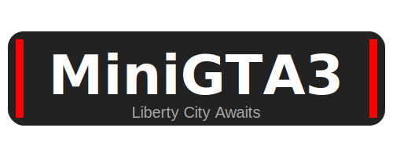
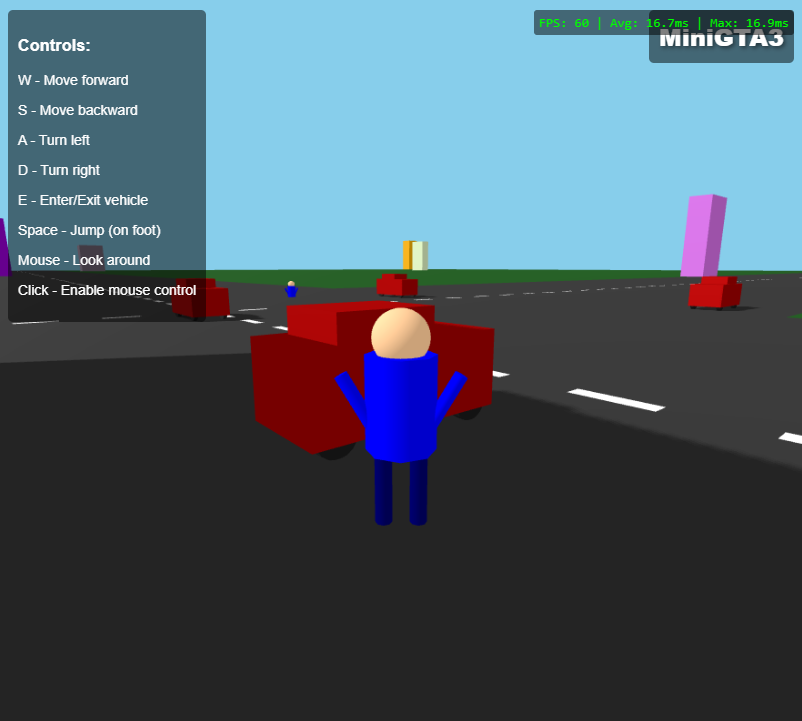

<p align="center">
  
</p>
# MiniGTA3

<p align="center">
  
</p>


MiniGTA3 is an experimental Vibe Coding project that leverages claude 3.7 sonnet. It offers third-person gameplay, drivable vehicles, and an open-world experience, all developed using TypeScript and Three.js.

## 🎮 Features

- **Open World Environment**: Explore a 3D city with buildings, roads, and obstacles
- **Character Controls**: Fluid third-person character controller with collision detection
- **Vehicle System**: Drive various vehicles with realistic physics
- **Player Interactions**: Enter/exit vehicles, interact with the environment
- **Dynamic Camera**: Camera system that adapts based on player state (on foot or in vehicle)
- **Day/Night Cycle**: Experience the city in different lighting conditions
- **Mission System**: Complete various missions and objectives
- **Pedestrian AI**: NPCs that populate the city streets

## 🕹️ Controls

- **W/A/S/D**: Move forward/left/backward/right
- **Mouse**: Look around
- **E**: Enter/exit vehicles
- **Space**: Jump (when on foot)
- **Click**: Enable mouse control for camera

## 🚀 Getting Started

### Prerequisites

- Node.js (v14 or higher)
- npm or yarn

### Installation

```bash
# Clone the repository (if you haven't already)
git clone https://github.com/kave-me/miniGTA3.git
cd miniGTA3

# Install dependencies
npm install
```

### Development

```bash
# Start the development server
npm run dev
```

The game will be available at http://localhost:5175

### Building for Production

```bash
# Create a production build
npm run build

# Preview the production build locally
npm run preview
```
