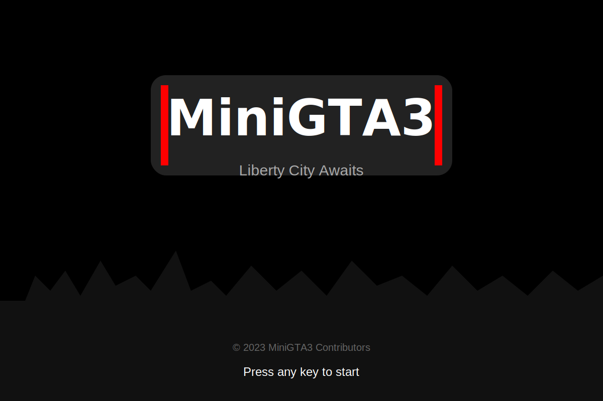

# MiniGTA3

<p align="center">
  
</p>


<p align="center">
  
</p>

<p align="center">
  
</p>

A lightweight reimagining of GTA3 that captures the essence of the original game in a modern, web-based implementation. MiniGTA3 features third-person gameplay, vehicle mechanics, and an open-world environment built with TypeScript and Three.js.

## 🎮 Features

- **Open World Environment**: Explore a 3D city with buildings, roads, and obstacles
- **Character Controls**: Fluid third-person character controller with collision detection
- **Vehicle System**: Drive various vehicles with realistic physics
- **Player Interactions**: Enter/exit vehicles, interact with the environment
- **Dynamic Camera**: Camera system that adapts based on player state (on foot or in vehicle)
- **Day/Night Cycle**: Experience the city in different lighting conditions
- **Mission System**: Complete various missions and objectives
- **Pedestrian AI**: NPCs that populate the city streets

## 🕹️ Controls

- **W/A/S/D**: Move forward/left/backward/right
- **Mouse**: Look around
- **E**: Enter/exit vehicles
- **Space**: Jump (when on foot)
- **Click**: Enable mouse control for camera

## 🚀 Getting Started

### Prerequisites

- Node.js (v14 or higher)
- npm or yarn

### Installation

```bash
# Clone the repository (if you haven't already)
git clone https://github.com/kave-me/miniGTA3.git
cd miniGTA3

# Install dependencies
npm install
```

### Development

```bash
# Start the development server
npm run dev
```

The game will be available at http://localhost:5175

### Building for Production

```bash
# Create a production build
npm run build

# Preview the production build locally
npm run preview
```

## 🔧 Technical Implementation

MiniGTA3 is built using modern web technologies:

- **TypeScript**: For type-safe, maintainable code
- **Three.js**: For 3D rendering and physics
- **Vite**: For fast development and optimized builds

The codebase is organized into several key components:

- **Game**: Main game loop and initialization
- **Player**: Player character and controls
- **Vehicle**: Vehicle mechanics and physics
- **Environment**: World, buildings, and collision objects
- **CameraController**: Third-person camera system
- **InputManager**: Keyboard and mouse input handling
- **MissionManager**: Mission system and objectives
- **PedestrianManager**: NPC behavior and AI

## 🛣️ Roadmap

- Add more vehicle types with different handling characteristics
- Expand the mission system with more complex objectives
- Improve physics and collision detection
- Add more sound effects and music
- Implement a more detailed city layout with different districts
- Add weather effects
- Implement a save/load system

## 📜 License

This project is licensed under the MIT License - see the [LICENSE](LICENSE) file for details.

## 🙏 Acknowledgements

- Inspired by the original Grand Theft Auto III by Rockstar Games
- Built using the re3 project structure as reference
- Uses Three.js for 3D rendering
- Special thanks to all contributors who have helped with the project

```bash
npm run build
```

## Controls

- W: Move forward
- S: Move backward
- A: Strafe left
- D: Strafe right
- Mouse: Rotate camera

## Project Structure

- `src/`: Source code
  - `main.ts`: Entry point
  - `Game.ts`: Core game loop and state management
  - `Player.ts`: Player movement and collision detection
  - `CameraController.ts`: Third-person camera behavior
  - `Environment.ts`: Terrain and buildings
- `public/`: Static assets
- `dist/`: Build output

## Inspiration

This project is inspired by the re3 repository but with a limited scope to ensure the project remains small and runs reliably in modern browsers.